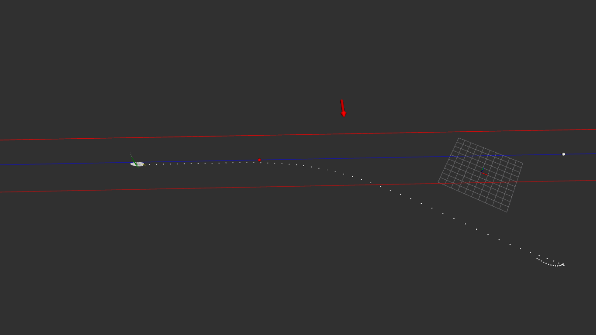
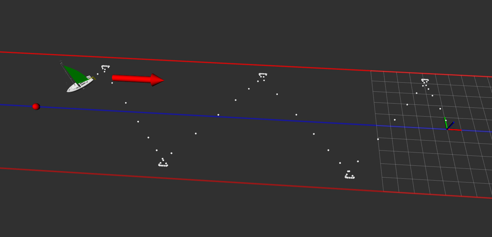
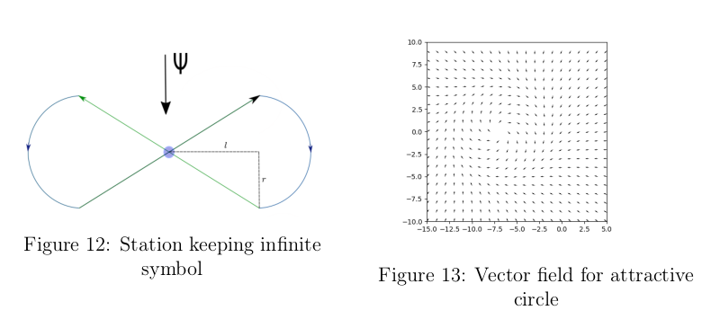
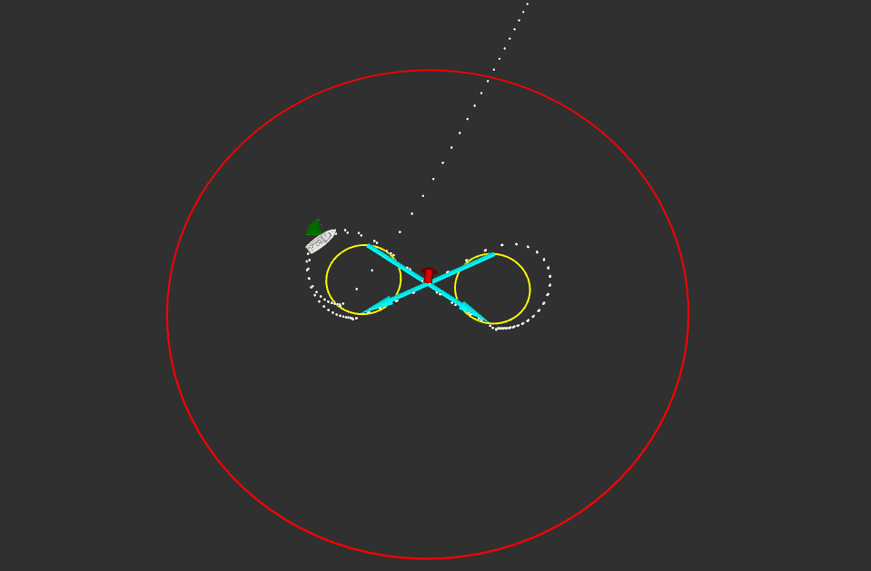
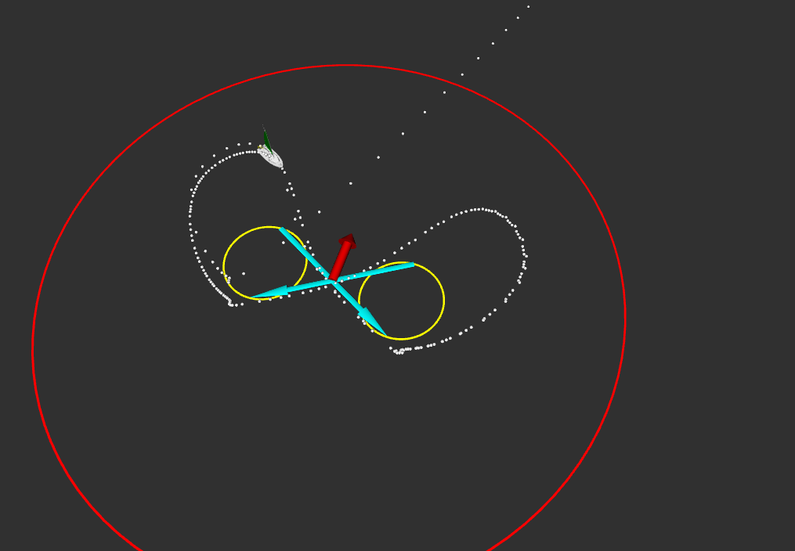
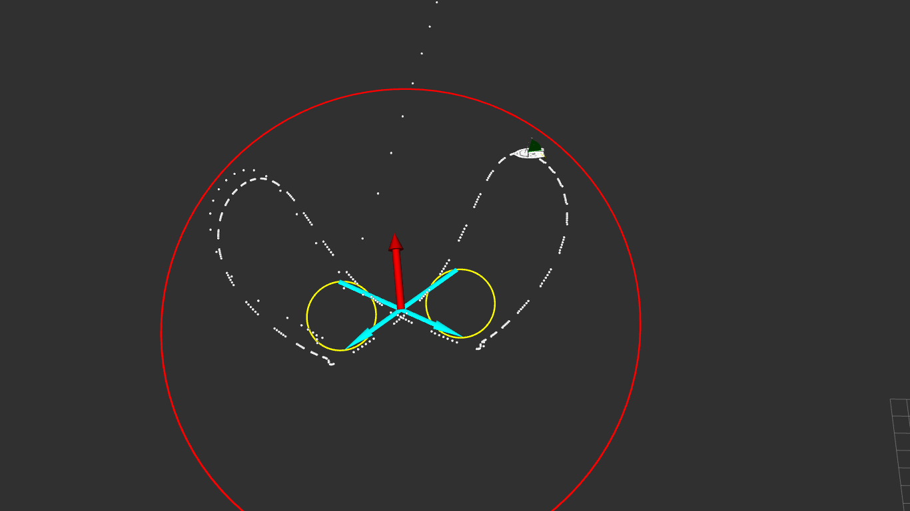

 <h1>Package simulation</h1>

The simulation folder consists of several .cpp files describing algorithms.

<h2>Line following algorithm</h2>

The algorithm used is taken from Luc Jaulin and Fabrice Le Bars
paper on sailboat: *A simple controller for line following of sailboats*.

A simulation on ROS and the use of the rviz tool allows us to visualize the figures below.

 

<h3>(a)  The boat follows the line AB shown in blue. The red lines represent the strip to never leave. (b) In this figure, we can see the boat going upwind. It performs a series of tacks called beating</h3>

<h2>Station keeping algoritm</h2>

Retention consists of sailing the boat around a certain area. An area represented by a circle. Many algorithms have been implemented to solve this problem. 
The idea of the first algorithm is to make the boat do a cycloid. This cycloid will be composed of two circles connected by two straight lines. To make the boat follow a circle, a vector field has been used. The figure below shows the shape of the cycloid and the vector field.

The next 3 figures show the boat performing the holding mission with different wind speed values. The purpose of these figures is to justify the robustness of the control law.

  
 
 <h3>From left to right, we observe the station keeping challenge for the different speed values v=1, v=3, v=5</h3>

