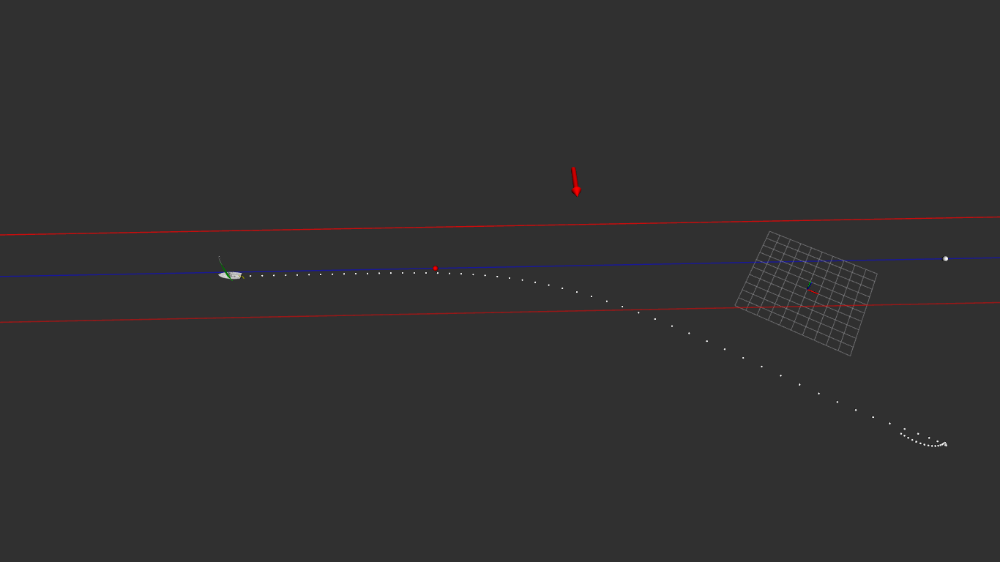
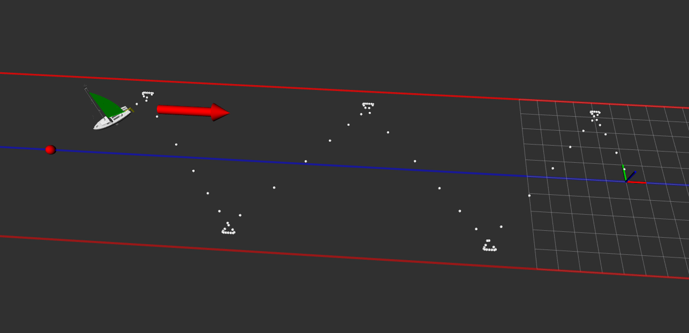

 **Package simulation**

The simulation folder consists of several .cpp files describing algorithms.

**Line following algorithm**

The algorithm used is taken from Luc Jaulin and Fabrice Le Bars
paper on sailboat: *A simple controller for line following of sailboats*.

A simulation on ROS and the use of the rviz tool allows us to visualize the figures below.

 

 **Getting Started**

This repository is a ROS package. Here is a quick description of the folders.

* *launch* : launch file allowed to run ros node.
* *meshs* : CAO files
* *src* : Scripts contained in this repository

 **Use this package**

1. Create a ROS workspace *mkdir -p ~/workspaceRos/src, cd ~/workspaceRos, catkin_make*.
2. In a terminal under workspaceRos/src_, type _*git clone https://github.com/mamadouDembele/sailboat.git*
3. Finally type *echo "source ~/workspaceRos/devel/setup.bash" >> ~/.bashrc*
You now have the package installed in *workspaceRos/src/sailboat*.

