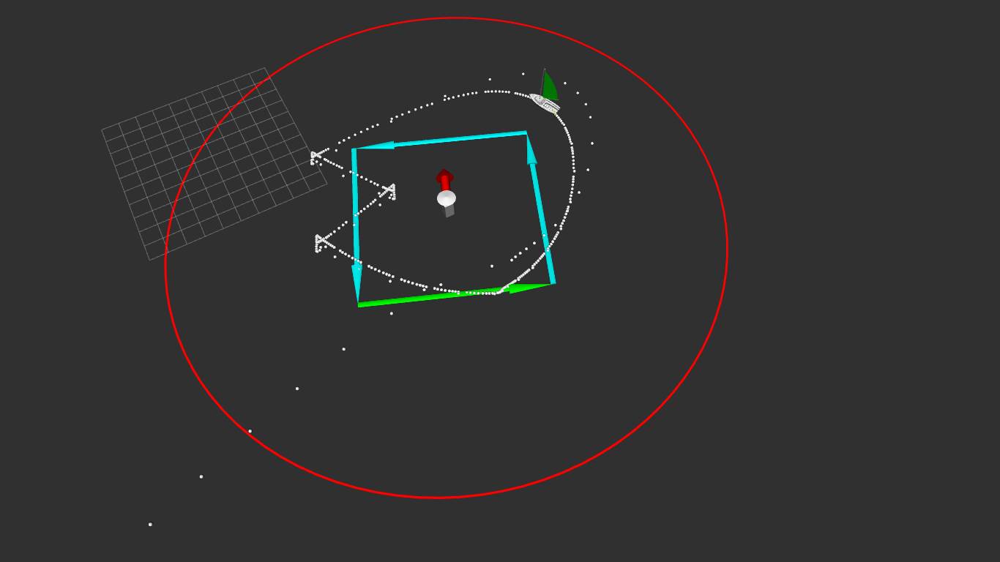

 <h1>Package simulation</h1>

The simulation folder consists of several .cpp files describing algorithms.

<h2>Line following algorithm</h2>

The algorithm used is taken from Luc Jaulin and Fabrice Le Bars
paper on sailboat: *A simple controller for line following of sailboats*.

A simulation on ROS and the use of the rviz tool allows us to visualize the figures below.

 

<h3>(a)  The boat follows the line AB shown in blue. The red lines represent the strip to never leave. (b) In this figure, we can see the boat going upwind. It performs a series of tacks called beating</h3>

<h2>Station keeping algoritm</h2>

Retention consists of sailing the boat around a certain area. An area represented by a circle. Many algorithms have been implemented to solve this problem. 
The idea of the first algorithm is to make the boat do a cycloid. This cycloid will be composed of two circles connected by two straight lines. To make the boat follow a circle, a vector field has been used. The figure below shows the shape of the cycloid and the vector field.

The next 3 figures show the boat performing the holding mission with different wind speed values. The purpose of these figures is to justify the robustness of the control law.

  
 
 

<h3>From left to right, we observe the station keeping challenge for the different speed values v=1, v=3, v=5</h3>

 
 
<h2>Station keeping algoritm and avoidance</h2>

For this situation two algorithms have been developed. The first one consists in making a triangle around a physical buoy while remaining a circle of well defined radius. As in the previous case, I varied the wind speed to test the efficiency of the algorithm.The figures below show these limits from a slightly high wind speed.

  

<h3>On the figures, the red arrow indicates the direction of the wind, the small white dots indicate the trajectory of the boat after several turns, The big dot in the middle is the physical buoy. </h3>

The second algorithm is that the boat can make a square. For this same problem the results are rather satisfactory than the first one. The boat manages to stay in the circle with the different speed values.

  

<h3>station keeping for different value of the speed</h3>

--------------------------------
<h1>Package mission</h1>
The other main objective of the internship is to be able to use previously developed algorithms in order to be able to carry out certain missions. These missions are challenges of the WRSC competition (World Robotic Sailing Championships).

See for more information https://www.roboticsailing.org/2019/rules/ 

<h2>Fleet race</h2>

For this mission the boat starts from a start line, passes three virtual buoy and then crosses the finish line. To validate a buoy, the boat must be within a radius of 5m around the buoy.The figure below illustrates the principle of the mission.

<h3>fleet race</h3>

<h2> Station keeping and avoidance </h2>
This mission is a combination of two of the algorithms described above. The first one is to stay in the zone for a certain time without constraint, then to leave this zone and go to another zone but this time to stay there while avoiding collisions with the physical buoy.

<h3>station keeping and avoidance</h3>

<h2> Collaborative area scanning</h2>
For this challenge to effectively analyze a terrain. 
Four boats will be deployed for this task. Every boat is to scan an area as soon as possible and during the mission, every boat can receive the trajectory of the other boats and those scanned by the other boats will not be considered as a useful area to scan. That means the four boats are to scan an area together and the more you scan new areas the better.

<h3>Area scanning</h3>

<h2>Reinforcement learning and Area scanning</h2>

After developing deterministic algorithms to solve the area scanning problem, I developed artificial intelligence algorithms (more precisely reinforcement learning algorithms) to solve the same problem.

Reinforcement learning is one of the three paradigms of machine learning, along with supervised and unsupervised learning.
an agent (robot, etc.) is placed in an environment, takes guesses according to its current state and receives from the environment the next state and a reward (positive or negative).
The objective of the agent in the reinforcement learning phase is then to seek a behaviour capable of accumulating the maximum of these rewards.

<h3>Interaction loop between the agent and its environment</h3>

<h3>Q-learning</h3>

Q-learning is a model-free reinforcement learning algorithm. It is an algorithm that estimates the optimal policy (which indicates what action to take in each state of the system) without using an initial model of the environment. Such an algorithm uses a state-action value function Q that measures the quality of an action in a state.
This Q function is defined using the Bellman equation:

<h3>Bellman Equation</h3>

At each Step of learning, this equation used to update the values of the Q-table.

A file called qlearning.py implements the Q-learning algorithm. In order to use it, the agent would first have to be trained. On line 362, set trainable to True (**trainable=True**). Then simply launch the python file using the console (**>> python qlearning.py**). The training will take some time.
At the end of the training a qtable file is generated in the current directory. 
In order to test the Q-learning algorithm, set trainable to False (**trainable=False**), move the generated qtable file to ***~/workspaceRos/devel/lib/sailboat***

Finally launch the challenge3.launch file using ***roslaunch challenge3.launch ***

<h3>Deep Q-learning</h3>

